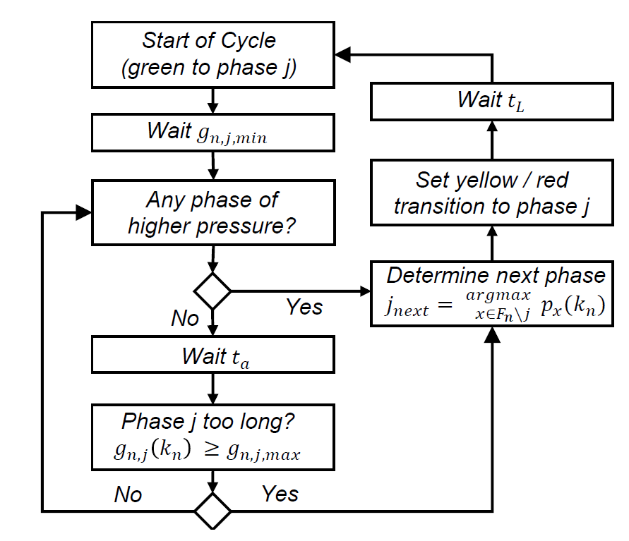
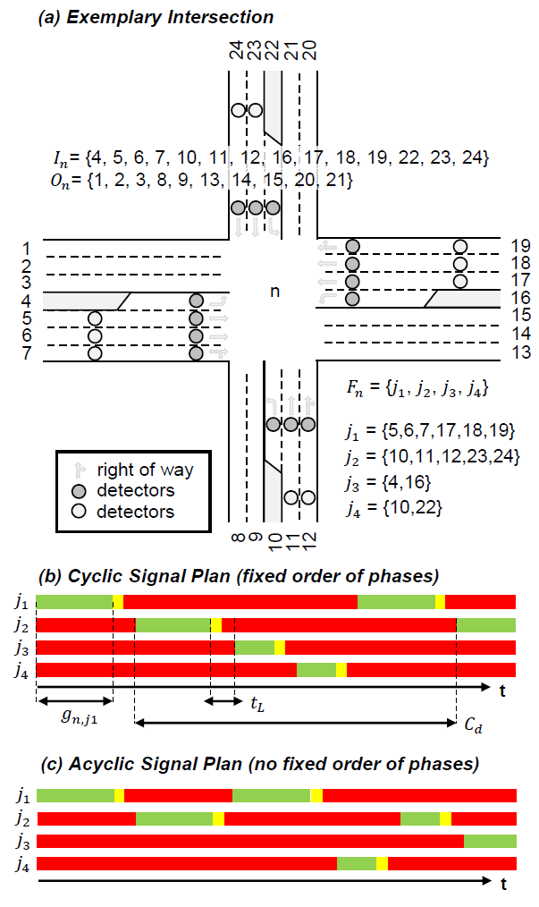
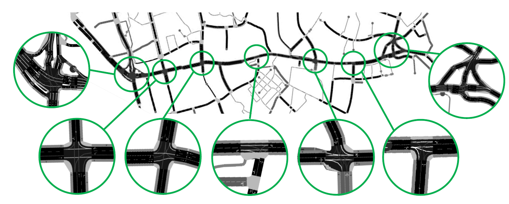
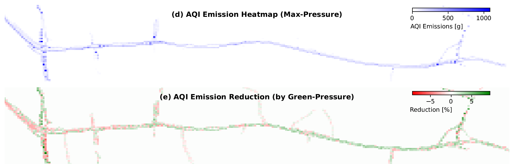

# Green-Pressure – A Weighted Queue-Length Approach Towards Sustainable Intersection Management

## Introduction

This is the online repository of *"Green-Pressure – A Weighted Queue-Length Approach Towards Sustainable Intersection Management"*. This repository contains a Python-implementation of a traffic microsimulation to demonstrate the potential of **Green-Pressure** controller. The repository is based on [SUMO (provided by DLR)](https://eclipse.dev/sumo/).

<table>
    <tr>
        <td></td>
        <td></td>
        <td></td>
    </tr>
    <tr>
        <td></td>
        <td></td>
        <td></td>
    </tr>
</table>

## Abstract
Urban transportation networks increasingly suffer from congestion. Negative externalities resulting from noise and pollution, affect public health, quality of life, and the economy. The major traffic bottlenecks in cities are conflicts at intersections, leading to this pressing issue. Intelligent transportation systems leverage sensors to optimize traffic flows, mainly by control of traffic lights. 

Green-Pressure is an extension of the Max-Pressure algorithm, that leverages vehicle category information from loop-detectors for a weighted queue-length approach, to reduce emissions at signalized intersections. 




A multimodal, case study of a real-world artery network with seven intersections, and 96 traffic signals, demonstrates the feasibility of the proposed method using a calibrated microsimulation model. Interestingly, the differentiation of vehicle categories at traffic lights not only enables reductions in emissions up to 9% but also improves traffic efficiency significantly (5% reductionof total travel time) when compared with the (unweighed) Max-Pressure controller. This is achieved by systematic prioritization of transporters, trucks, and buses, at the cost of slightly larger delays for passenger cars and motorcycles. 




Ultimately, the proposed method has the potential to achieve more sustainable road traffic leveraging existing sensor infrastructure.


## What you will find in this repository

This repository contains the simulation model and source code to reproduce the findings of our study (with certain restrictions due to legal reasons).
The folder contain following information:

```
./
├── code/
│   ├── RunSimulation.py
│   └── NASH_Optimizer.py
├── data/
│   ├── Emission_VehiclePopulation.xlsx
│   └── bus_schedule/
├── figures/
│   └── ...
├── logs/
│   ├── logs_green_pressure.zip
│   └── logs_max_pressure.zip
└── model/
    ├── Configuration.sumocfg
    ├── Network.net.xml
    └── ...
```

- The source code for this study can be found in folder *code/*.
- Emission model data, and bus schedule information can be found in folder *data/*.
- Some of the figures used in the paper can be found in folder *figures/*.
- The log files used for the analysis in this study can be foud in folder *logs/*.
- The SUMO model and all related files can be found in folder folder *model/*.


## Installation & Run Instructions

```
pip install -r requirements.txt
python code/RunSimulation.py --help
# python RunSimulation.py --sumo-path [A] --controller [B] --weights [C]
```

To run the simulation, two to three runarguments are necessary:
- [A] path to SUMO installation directory
- [B] control algorithm, Options: ["FIXED_CYCLE", "MAX_PRESSURE", "GREEN_PRESSURE"]
- [C] weights for Green-Pressure Controller, to be provided as String with no spaces!, e.g. "1.0,2.0,3.0,4.0,5.0"

### Example Command To Launch Simulation
**with a FIXED_CYCLE controller**
```
python RunSimulation.py --sumo-path ./sumo-1.19.0/bin/sumo-gui.exe --controller FIXED_CYCLE
```

**with a MAX_PRESSURE controller**
```
python RunSimulation.py --sumo-path ./sumo-1.19.0/bin/sumo-gui.exe --controller MAX_PRESSURE
```

**with a GREEN_PRESSURE controller**
```
python RunSimulation.py --sumo-path ./sumo-1.19.0/bin/sumo-gui.exe --controller GREEN_PRESSURE --weights 1.0,2.0,3.0,4.0,5.0
```

After running, a folder "logs" will appear in "/model/logs" that contains log files created by SUMO, with following contents:

## Log Files
| Log-File    | Description |
| -------- | ------- |
| Emissions.xml  | Log file with information about emissions. |
| Log_summary.xml | Log file with information about the networks traffic state for regular intervals. |
| TripInfos.xml | Log file with information about single vehicle's trips. |


## Citation
If you found this repository helpful, please cite our work:
```
Kevin Riehl, Anastasios Kouvelas, Michail A. Makridis
"Green-Pressure – A Weighted Queue-Length Approach Towards Sustainable Intersection Management", 2025.
Submitted to CDC2025: 64th IEEE Conference on Decision and Control, Rio de Janeiro, Brazil.
```